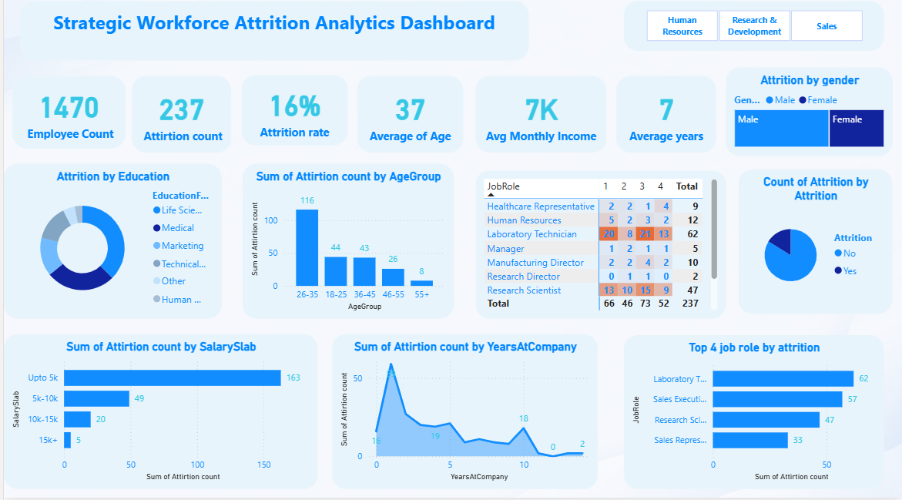
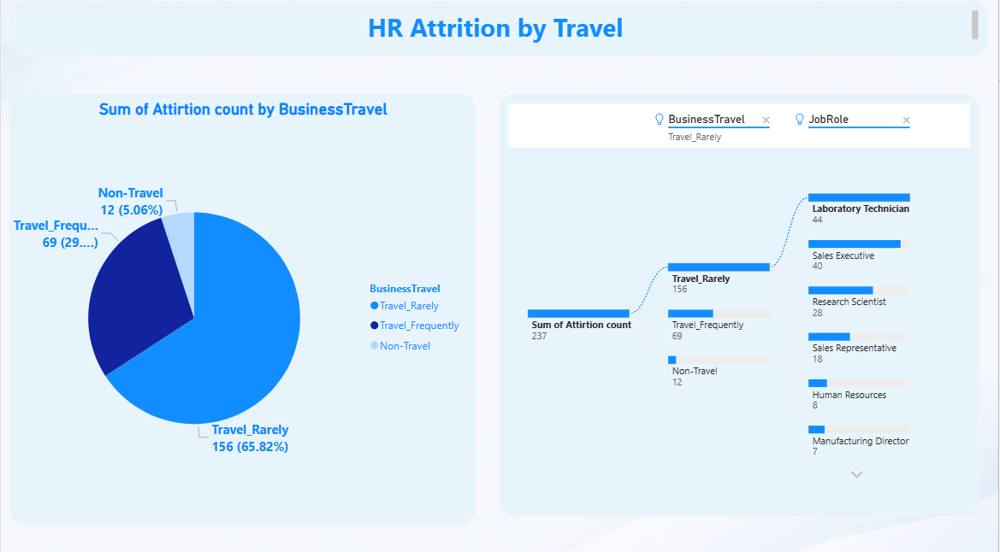

 HR Attrition Analytics Dashboard (Power BI)

📌 Project Overview
This project focuses on analyzing employee attrition using HR analytics data to identify key factors influencing employee turnover. The interactive Power BI dashboard provides actionable insights to help HR teams and management improve employee retention strategies.

---

 🎯 Business Objective
- Identify departments and job roles with high attrition
- Understand attrition trends based on age, salary, education, travel, and tenure
- Support data-driven HR decision-making to reduce employee turnover

---

 📊 Key Insights
- Overall attrition rate is 14%, indicating moderate employee turnover
- Sales Representative and Laboratory Technician roles show the highest attrition
- Employees aged 26–35 contribute the most to attrition
- Attrition is highest among employees earning below 5K salary
- Employees with frequent business travel show higher attrition risk
- Majority of attrition occurs within the first few years at the company

---

🛠 Tools & Technologies Used
- Power BI – Data modeling, DAX measures, and dashboard creation  
- Excel / CSV – Data source and preprocessing  
- DAX – Calculated measures (Attrition Rate, KPIs)  

---

 📂 Files in This Repository
- `HR_Attrition.pbix` – Power BI dashboard file  
- `HR ATTRITION PROJECT.pdf` – Dashboard export for quick viewing  
- `HR_Analytics.csv` – Dataset used for analysis  
- `README.md` – Project documentation  

---

 📈 Dashboard Features
- KPI cards for Employee Count, Attrition Count, Attrition Rate
- Attrition analysis by:
  - Job Role
  - Department
  - Age Group
  - Salary Slab
  - Education
  - Gender
  - Business Travel
  - Years at Company
- Interactive slicers for dynamic filtering

---

🚀 Conclusion
This HR Attrition Analytics dashboard demonstrates practical data analysis, visualization, and business storytelling skills. The project reflects real-world HR analytics use cases and highlights how data can support strategic workforce planning.

---
Screenshots:

1. HR Attrition Analytics Dashboard

2. Attrition by Travel

3. HR Attrition Q&A

👩‍💻 Author

Amreen Mulla 
Aspiring Data Analyst | SQL | Power BI | Excel | Python  
